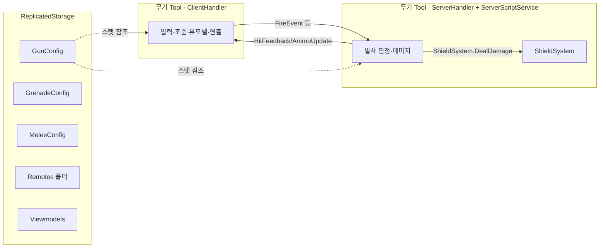

# 코드 구조 — Roblox Studio 실제 분석

> 2026-06-05, Roblox Studio "스쿨 킹 (공동 작업실)" 실제 데이터모델을 직접 분석해 작성.
> **설정(Config) 기반 모듈 구조** — 무기 스탯은 코드가 아니라 Config 모듈에 모여 있어,
> 새 무기는 "Config에 항목 추가 + Tool 핸들러"만으로 늘린다.

## 핵심 패턴 한 장



## 서비스별 배치

| 위치 | 내용 |
| --- | --- |
| `ReplicatedStorage/GunSystem` | `GunConfig`(ModuleScript), `Recoil`(수직 반동), `SpreadState`, `Remotes/`, `Sounds/`, `Animations/`, 탄환 메쉬 |
| `ReplicatedStorage/GrenadeSystem` | `GrenadeConfig`, `Remotes/`, `ProjectileTemplates/`, `Animations/` |
| `ReplicatedStorage/MeleeSystem` | `MeleeConfig`, `Remotes/`, `Animations/` |
| `ReplicatedStorage/Viewmodels` | 무기별 1인칭 뷰모델(CompassVM, LegCrutchVM, ToasterVM, CupVM, DustpanVM, SiliconGunVM …) |
| `ReplicatedStorage/SharedFX` | `SlideTilt`, `RunTilt`, `ThirdPersonAnims`, `WeaponRig3P`(3인칭 무기 리깅) |
| `ServerScriptService` | `ShieldSystem`(module), `ShieldSystemInit`, `HealHandler`, `RegenSystem`(HP 자동회복), `CapturePointSystem`(거점 점수·승리), `FireExtinguisherSystem`(소화기 연막), `RespawnSoundServer`, `BotManager`, `DeathShatter`, `DummyCloseShooter` |
| `StarterPack/<무기>` | 무기 Tool = `ClientHandler`(LocalScript) + `ServerHandler`(Script) — Compass, LegCrutch, Toaster, SiliconGun, Cup, CAN, Dustpan |
| `StarterPlayer/StarterPlayerScripts` | `CustomFPCamera`, `FaceCameraLock`, `WeaponEffectsClient`, `Sound3DListener`, `HealController`, `HandsController`, `AnimPreloader`, `DamageNumbers`(데미지 표기 통합), `EnemyOutline`, `OverheadShield`, `KillerReveal`, `ScoreHUD`(랭킹·획득 표시), `HUDResponsive`(해상도 대응), `MovementSounds`, `HitSounds`, `RespawnSound` |
| `StarterPlayer/StarterCharacterScripts` | `SlideScript`, `Health`(기본 체력 자연재생 비활성화) |
| `StarterGui/GameHUD` | `HUDController`, `CrosshairController`, `CaptureHUDBinder`(점수·타이머 바인딩) |
| `StarterGui/GunUI` | `GunUIController` |

## 무기 한 자루의 구조 (Tool 패턴)

```text
StarterPack/Compass (Tool)
├── ClientHandler (LocalScript)   -- 입력, 뷰모델, 조준(ADS), 반동/스웨이, 연출
└── ServerHandler (Script)        -- 발사 요청 수신, 히트 판정, 데미지(서버 권위)
```

무기 7종 모두 동일: **LegCrutch · Compass · Cup · CAN · Dustpan · Toaster · SiliconGun**.

## 통신(RemoteEvent) 맵

| 이벤트 | 위치 | 방향 | 용도 |
| --- | --- | --- | --- |
| `FireEvent` | GunSystem.Remotes | C→S | 발사 요청 |
| `ReloadEvent` | GunSystem.Remotes | C→S | 재장전 |
| `ToggleFireModeEvent` | GunSystem.Remotes | C→S | 발사 모드 전환(B) |
| `MeleeEvent` | GunSystem.Remotes | C→S | 근접 공격(V) |
| `AmmoUpdateEvent` | GunSystem.Remotes | S→C | 탄약 UI 갱신 |
| `HitFeedbackEvent` | GunSystem.Remotes | S→C | 피격 히트마커 |
| `VisualEffectEvent` | GunSystem.Remotes | S→C | 트레이서/머즐 등 연출 |
| `Sound3DEvent` | GunSystem.Remotes | S→C | 3D 사운드 |
| `ShieldUpdate` | ReplicatedStorage | S→C | 쉴드 값 HUD 갱신 |
| `HealRequest` | ReplicatedStorage | C→S | 회복 요청 |

> 원칙: 데미지·판정은 항상 **ServerHandler / ShieldSystem(서버)** 에서 확정. 클라는 요청·연출만.

## 체력·쉴드 (ShieldSystem, 서버 권위)

`ServerScriptService/ShieldSystem` (Apex 스타일). 플레이어·NPC 모두 지원.

- **최대 체력 100 + 최대 쉴드 100** (코드 기준: `DEFAULT_MAX_HEALTH=100`, `DEFAULT_MAX_SHIELD=100`)
- 데미지는 **쉴드 먼저 흡수 → 남은 만큼 체력 감소** (`DealDamage`)
- 기본 체력 자연재생은 꺼져 있음(빈 `Health` 스크립트). 회복은 `HealHandler` + `HealRequest`로 처리.

자세히는 [전투/데미지 시스템](./systems/combat/combat-damage-system.md).

## 설정 상속 패턴 (중요)

각 Config는 `setmetatable(무기, { __index = Default })` 로 **Default를 상속**한다.
무기 항목에 적지 않은 값은 자동으로 `Default`에서 가져온다.

```lua
GunConfig.Compass = setmetatable({
    DisplayName = "Compass", Damage = 22, MagazineSize = 15, FireMode = "burst",
}, { __index = GunConfig.Default })   -- 나머지는 Default 상속
```

→ **새 무기 추가 = Config에 한 블록 추가** + 뷰모델/핸들러 연결. 코드 본체는 안 건드림.

## 관련

- 무기 스탯 전체: [무기 시스템](./systems/combat/weapon-system.md)
- 시스템 맵: [아키텍처 개요](./index.md)
