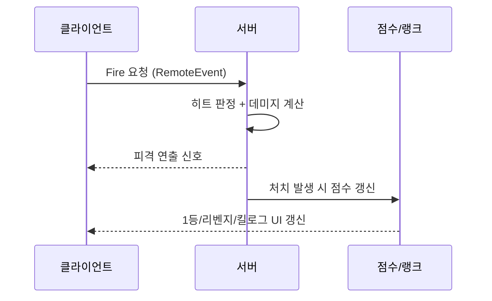

# 데이터 흐름: 발사에서 처치까지

```mermaid
sequenceDiagram
  participant C as 클라이언트
  participant S as 서버
  participant R as 점수/랭크
  C->>S: Fire 요청 (RemoteEvent)
  S->>S: 히트 판정 + 데미지 계산
  S-->>C: 피격 연출 신호
  S->>R: 처치 발생 시 점수 갱신
  R-->>C: 1등/리벤지/킬로그 UI 갱신
```

관련: [전투/데미지 시스템](./systems/combat/combat-damage-system.md), [점수/랭크 시스템](./systems/meta/scoring-rank-system.md).
