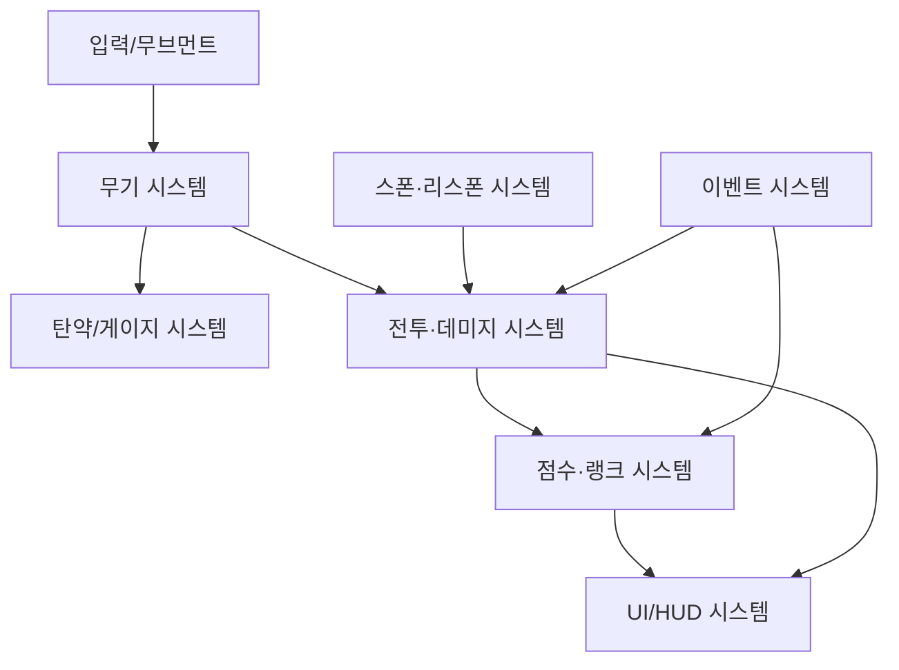

import DocCardList from '@theme/DocCardList';

# 시스템 아키텍처 개요

> 📌 실제 Roblox 코드 구조 분석은 **[코드 구조](./code-structure.md)** 참고 (설정 기반 모듈·통신 맵·체력/쉴드).

## 시스템 맵

## 시스템 목록

| 시스템 | 책임 | 문서 |
| --- | --- | --- |
| 무기 | 무기 정의·발사·전환 | [weapon-system](./systems/weapon-system.md) |
| 탄약/게이지 | 장탄·재장전·특수 자원 | [ammo-system](./systems/ammo-system.md) |
| 전투/데미지 | 히트 판정·데미지·체력/쉴드 | [combat-damage-system](./systems/combat-damage-system.md) |
| 스폰/리스폰 | 랜덤 스폰·무적·리스폰 | [spawn-respawn-system](./systems/spawn-respawn-system.md) |
| 점수/랭크 | 포인트·1등·ESP·리벤지 | [scoring-rank-system](./systems/scoring-rank-system.md) |
| UI/HUD | 체력·탄약·킬로그·알림 | [ui-hud-system](./systems/ui-hud-system.md) |
| 이벤트 | RemoteEvent 통신 규칙 | [event-system](./systems/event-system.md) |

## 통신 원칙

- 서버 권위: 데미지/생성/판정은 서버에서 확정한다.
- 자세한 규칙: [클라이언트-서버 모델](./client-server-model.md), [데이터 흐름](./data-flow.md).

## 📂 하위 문서

<DocCardList />
