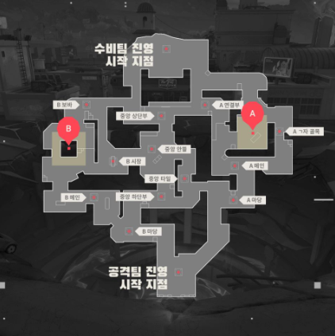

# 26.01.11

기획서 - 시스템 정의

맵 예시 - 발로란트 맵

체력 100 + 쉴드 50

사람 잡으면 피 찬다.

쉴드를 등수가 낮으면 낮을수록 많이 보유 ( ex10등 쉴드 100 1등 쉴드 10~30 ttk 1초(미정) )

쉴드는 자동 회복 (비전투 상태 2초정도 후 초당5에서 10씩 회복)< 딜교를 지더라도 기회가 생길정도의 회복량 

1등 혜택 ( 1등인 상태로 적을 죽이면 적 화면에서 춤을 춤 깨빡치는) 

에임핵(일시적) 

esp

**이속버프 / 재장전 속도 + URF 불타는 효과 + 왕관**

동민

1~5등 기본 쉴드 유지 (체력 100 + 쉴드 50)

6등~10등 쉴드 차등적 증가 버프 (60,70,80,90,100)

연속 킬 달성 시 **재장전+이동속도 증가**

1~3등 금,은,동 **해골 표시 + URF효과 + 왕관(1등만) // 위치 보임**

**URF 불타는 효과 + 왕관**

시각적으로 주는 것만 있어도 충분하다!

챔피언ㅡ입니다!! → 보급 무기 없자나..
모든 참가자 궁극기 사용 가능 (3~4킬 한번에 하는 느낌) - 쉴라, 바주카, 레이저포 등등

**1등 달성 후 연속킬(2킬) 달성 시, 불타는 효과 + 왕관** 
1등 본인은 주변 적 ESP로 보임 잠깐(0.5초)
나머지 애들도 1등이 킬을 따면 1등 위치가 잠깐 보임(1초)

데스매치 점수제 라는 구조 자체를 바꾸고 싶은건 아님.
다들 동일한 조건에서, 프리셋만 다르게 싸우는 느낌

→ 총, 수류탄, 권총 이런거에 차별점 주려고 했던게 아닌가.

쉴드가 최대가 100인데

**26.01.11 확정 내용**

- 데스메치 포인트 기반 무브먼트  fps
- 스폰위치 랜덤
- ttk 3초~5초
- 최대 인원수 10명
- 리스폰 랜덤, 스폰 후 2초 무적(공격 가능)
- 1등 연속 킬 시 불타는 효과, 왕관, ESP 짧게(0.5초), **재장전+이동속도 증가 (1초, ESP랑 동일하게 해도 될것 같기도..) - 이 상태의 1등을 잡으면 2킬로 취급.**
- 1등 제외 나머지, 1등 ESP 발동 시 1등의 위치 보임(1초)
- 리벤지시, “리벤지를 당했습니다!” (가장 최근에 죽인 적이 날 죽였을 때 알려줌)
- 체력 100 + 쉴드 50 고정, **사람 죽이면 체력 100회복, 쉴드는 2초 동안 비전투시 회복(5~10 p/s)**