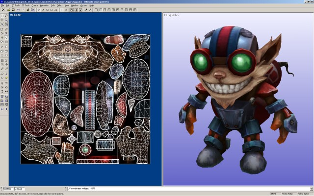
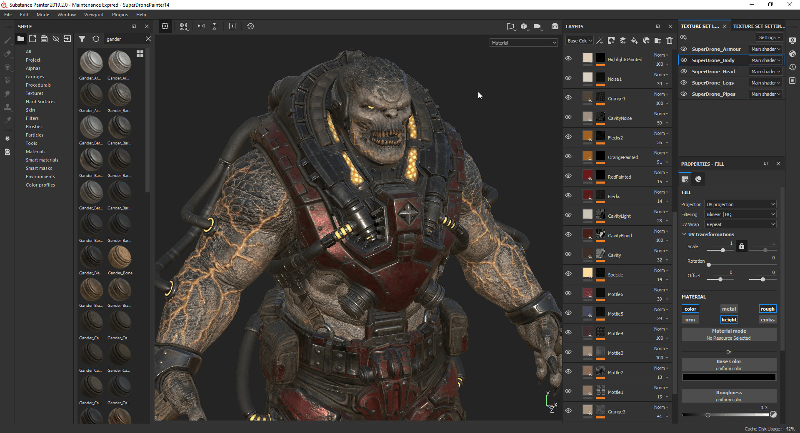
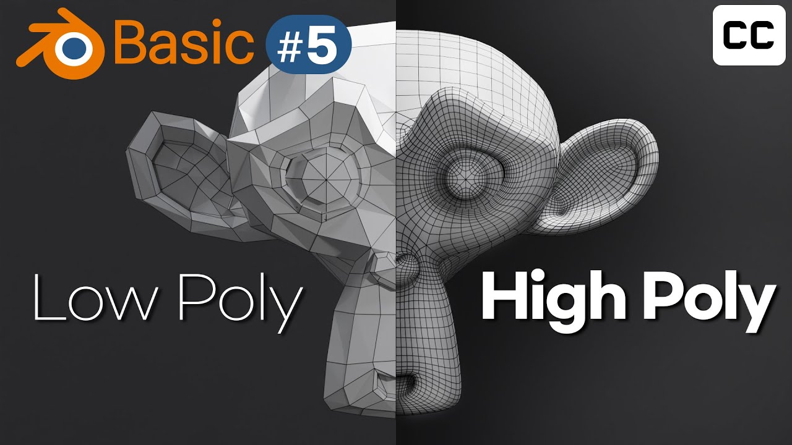

# 26.01.25

개판 싸움 알아두기 - 개판으로 싸움에도 불구하고 게임의 전체적인 흐름에 대해 알아보자.

무기에 따른 변경점 체감하기 - 무기에 따라서 플레이 스타일이 달라진다

맵 구조 한번 확인해보기 

팀포트리스 2의 기본 리스폰(부활) 시간은

**보통 10~20초 주기의 웨이브(Wave) 방식**

으로 작동합니다. 팀 인원이 적으면 5초까지 단축되며, 맵과 상황에 따라 고정되거나 변동됩니다.

사망 시점에 따라 대기 시간이 달라지며, 특정 커스텀 서버에서는 즉시 부활이 가능합니다.)

서류 쟁탈전 3점 

리스폰 지역에서 각 팀의 서류가 스폰

뚫고 들어가서 주워와야하고, 서류를 주우면 들었다는 표시가 생김 (이펙트가 따라다닌다.)

우리가 만들고자 하는 기본 모드는 데스매치 (개인) , 최종 몇 킬 먼저딴 사람이 이기는 거.

김준범 *수류탄 투척 모션,머그잔 모델링 다음 주 까지 제작해 올 예정

               머그잔 만들기그잔 UV완성은 수요일 28일) 

이준서 * UV에 그림그리기 ^_^, 개발 흐름 구상 (토일까지 31일) 

김동민 * 애니메이션 불러오는 키 설정 및 던지기 (2월 8일까지 모션 활성화)

이후 일요일 2월1일 일요일 에 그래픽 테스트

*원하는 그래픽,텍스쳐 스타일 - (8비트 ,도트+3D 그래픽) * 리썰컴퍼니*

[https://www.youtube.com/watch?v=kr0cMg_Y0YU](https://www.youtube.com/watch?v=kr0cMg_Y0YU)

-VFX (Visual Effects,**시각 특수 효과)**- 

VFX는 ai 제작 또는 프리셋,템플릿을 사용 (VFX는 제작도 어렵고 사용 프로그램이 비쌈)

-텍스쳐-

Ai로 캐릭터 텍스쳐 임시 파일 제작 후 모델의 UV를 내가 조정해서 substance에서 겹쳐서 하이폴리로 적용할 예정

(3d 모델의 UV)

(3d substance painter)

(로우 폴리 위에 하이 폴리 덮씌우기)

팀포2 고찰

1. TTK 매우 빠름 - 거의 카스 급
2. 난전인 이유는 한판에 들어가는 인원수가 매우 많으며, 맵이 좁음 < 즉 유저가 딴길로 안새고 바로바로 교전에 들어감 구조적으로 직관적이지만, 리스폰쿨타임을 10~20초로 설정하여 제한함
3. 한 명이 분대 전원을 몰살할 수있음 구조적으로 즉 개개인의 파워가 매우강함
4. 역할 분배 (가위바위보 심리전)
5. 힐팩, 힐러가 주는 힐보다 총기 데미지가 더쌤 ( 에임만 좋으면 다죽일수있음 3번이랑 이어짐)
6. 범위기 가 많음 < 한방에 폭
7. 스파이가 존나 쎔… < 파이로가 잘 하면 괜찮대
8. 의사소통이 빡셈, 핑찍는 게 없기도 하고, 메딕 찾는 거에 채팅창이 너무 빨리 넘어감
9. 여러 역할 군의 숙련도를 요구함.
10. 각 병과 별 상성 차이 말고도 각자가 착용한 **무기의 특성**에 따라 또 상성 차이가 발생하기 때문에
난전이 일어나도 어느정도 균형이 유지됨.<무기 특성이 중요할 듯 *(가위바위보 생태계)*
유저가 로비(허브)에서 복수의 프리셋을 지정함 < 프리셋을 만드는데 있어서 제한은 없지만,
 어느정도 가위바위보를 할수있는 구조를 만드는게 중요하겠네요. 
11. 팀전 모드 고려 (거점 점령, 화물밀기, 쟁탈전)
12. TTK가 너무 길면 안될같은 느낌  

>라이플 길어도 2초 다맞춘다 가정하에, SMG 1.5 스나 원콤만 안날정도 죽는건 ㅈㄴ 빠른데, 리스폰이 ㅈㄴ김

리스폰도 빠른대신에, TTK 가 여타 다른 FPS에 비에 좀 김

속도감 늘리고, 개성있는 무기가 있다면 회전율만 나오면 재미는 있는데, 피곤함 그거를 방금 팀포하면서 느낌

원인은 짧은 TTK 긴 리스폰 타임, 이동시간이 ㅈㄴ 김 병과마나 기동성이 달라서 타이밍이 안맞음

1. 스폰장소에서 나와서 적을 만나기까지 40초 ~ 1분30초정도? 우리가 만들때는 10~20초 정도로 단축을 목표

개선점: 스폰킬 방지 , 평지 층구조 X

## 팀포2 플레이 고찰 정리

### 1. 전투 템포 & TTK

- **TTK(Time To Kill)가 매우 빠름**
    - 체감상 CS급에 가까움
    - 에임이 좋으면 힐을 받기 전에도 즉사 가능
- **TTK가 길어지면 재미가 떨어질 가능성**
    - 라이플: 최대 2초 풀히트 기준
    - SMG: 약 1.5초
    - 스나이퍼: 원콤은 제한적
- 전투 자체는 빠르지만, **리스폰과 이동이 느려서 템포가 깨짐**

👉 핵심 인사이트

> “죽는 건 빠른데, 다시 싸우기까지 너무 오래 걸린다”
> 

---

### 2. 난전이 발생하는 구조적 이유

- 한 판에 참여하는 **인원 수가 많음**
- **맵이 좁고 동선이 직관적**
    - 유저가 딴 길로 새지 않고 바로 교전에 진입
- 대신 이를 제어하기 위해 **리스폰 타임이 10~20초로 길게 설정됨**

👉 결과

- 전투는 혼잡하고 빠르지만
- 한 번 죽으면 게임에서 이탈한 느낌이 강함

---

### 3. 개인 파워가 매우 강한 구조

- **한 명이 분대 전원을 몰살할 수 있음**
- 개개인의 에임·무기 이해도가 전황에 큰 영향을 미침
- 힐팩 / 메딕의 힐보다 **총기 데미지가 우위**
    - “에임만 좋으면 다 죽일 수 있음”

👉 팀 게임이지만 **캐리력 높은 개인 중심 FPS**

---

### 4. 역할 분배 & 상성 구조

- 병과 간 **가위바위보식 상성 구조**
- 단순 병과 상성뿐 아니라
    
    **장착 무기 특성에 따라 추가 상성 발생**
    
- 난전 속에서도 완전한 붕괴가 일어나지 않는 이유

👉 핵심 포인트

- **무기 특성 설계가 게임 밸런스의 핵심**
- 같은 병과라도 무기에 따라 완전히 다른 역할 수행

---

### 5. 무기 & 프리셋 시스템

- 유저가 로비(허브)에서 **복수의 프리셋을 사전 구성**
- 프리셋 개수 제한은 없지만
    - 결과적으로 가위바위보 생태계를 형성해야 함
- 상황 대응용 프리셋 교체가 중요

👉 설계 방향

- 자유도는 높되,
- **메타가 자연스럽게 순환되도록 유도**

---

### 6. 범위기 & 스킬 영향

- **범위 공격 무기가 많음**
- 한 방에 전황이 바뀌는 상황 자주 발생
- 난전 가속 요인

---

### 7. 특정 병과 이슈

- **스파이의 파워가 매우 강함**
- 파이로가 잘하면 카운터 가능하지만 숙련도 요구 큼

👉 카운터는 존재하지만

**인지 + 숙련도를 동시에 요구**

---

### 8. 커뮤니케이션 문제

- 핑 시스템 부재
- “메딕!” 같은 채팅이 너무 빨리 묻힘
- 전투 밀도가 높을수록 의사소통 난이도 급상승

👉 팀플레이 난이도가 불필요하게 높아짐

---

### 9. 숙련도 요구

- 단일 병과 숙련만으로는 부족
- **여러 역할군 이해 및 전환 능력 필요**
- 초보자 진입 장벽 존재

---

### 10. 팀전 모드 구조

- 주요 모드:
    - 거점 점령
    - 화물 밀기
    - 쟁탈전
- 맵 구조상 계속 충돌을 유도하는 형태

---

### 11. 이동 & 리스폰 문제 (피로감의 원인)

- 병과별 이동 속도 차이 큼
- 스폰 → 교전까지 **40초 ~ 1분 30초 소요**
- 리스폰은 빠른 편인데, **이동 시간이 지나치게 김**

👉 체감 원인 요약

- 짧은 TTK
- 긴 리스폰 타임
- 긴 이동 시간
- 병과 간 속도 불일치로 타이밍 어긋남

---

### 12. 우리가 참고할 개선 목표

- 스폰 → 교전까지 **10~20초 내 진입**
- 스폰킬 방지 설계 필수
- 평지 위주의 단조로운 층 구조 지양
- 전투 회전율(Respawn → Re-engage) 극대화

---

## 한 줄 요약

> 팀포2는 **“개인의 파워가 매우 강한 빠른 전투”**가 장점이지만,
> 
> 
> **긴 이동·리스폰 구조로 인해 피로감이 누적되는 게임**이다.
> 
> 우리가 만들 게임은 **전투 회전율을 줄이지 않으면서 난전을 즐기게 만드는 구조**가 핵심이다.
>