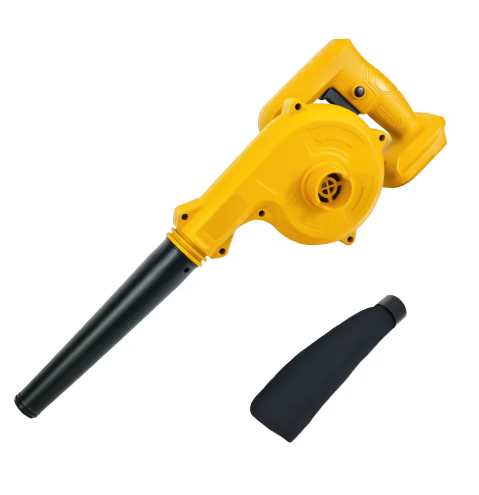

# 26.05.02

오늘 할일 
1. 추가 무기
2.게임 시스템
3. 작업 조율
4. 스케줄 조율

현재 무기 : 
1. 컵 쓸레받이 컴퍼스 인데, 수류탄 1종 총기류 5종 추가하고 싶습니다. 
2. 시간 남으면 근무도 하나
 - 일단 총기류부터 어떤걸 만들지 미리 정하고싶음. 
 -지금 일정상  5월 31일가지는 대략적인 총기 디테일, 시스템 등이 가춰져야 TGS 를 노려볼만 할것 같습니다.

-10일~17일 사이에는 준범이가 모델링을 끝내 줘야하고 그사이에 에니메이션을 만지고 있으면 그사이에 동민이는 버그, 수정사항 , 시스템 ( 기본 시스템 구축)을 진행 하면 됩니다.

유저가 스폰함 (어느 위치)- 카운트 다운( 321) - 점수판 

총기 벨런스 - 데미지 배울, 연사 속도, 인체공항( 총기를 드는 속도, 견착 속도, 반동)

목표는 7월 중순 즘에 MVP 완성 (컴펌 교수한테)~8월에 수정사항, 버그 픽스 ,컴펌~9월 17 TGS 

쓰레받이

1. 실링폼 (특무)- 벽설치
2.  대형 청소기 (특무)-밀치기 당기기

---

주무기와, 특수무기로 나눔

주무기 -특별한 능력이 없고, DPS 용 (AR,SMG,샷건)

특수무기- DPS보다 특수 능력이 있음 ( 벽새우기, 섬광, 슬로우, 그랩?당기기 등등)

원래 기획

주무기 2개 근무 하나

변경 요청 사항

주무기1 , 특수무기1,  근무1 

---

최종적으로 나오는 무기 개수

주3, 특3, 근2, 투척2 OR 주4 특2 “

**결론**

**주 무기 - 목발(기본 AR), 컴퍼스(기본 SMG), 토스터기(기본 더블배럴 샷건), 시간 남으면 (우산-스나)**

**특수 무기 - 청소기, 실링폼**

**투척 무기 - 탄산음료(흔들어서 던짐, 세열), 머그컵(테르밋 수류탄)**

**근접 무기 - 쓰레받이 (가드모션 , 휘두르기), 주먹**

---

---

삼각대 (게틀링건 , 장전속도가 느리지만, 많은 장탄수와 높은 데미지)              

[ПКП Печенег 7.62х54](https://www.youtube.com/watch?v=i0Z0PbO9gZw)

우산 ( 샷건 ,접었다가 펼치면서 물줄기로 공격)

[The Umbrella That's Also a Water Gun!](https://www.youtube.com/shorts/hHW-i5gCO6w)

비눗방울 (smg 탄환이 크지만, 느린 범위 공격)

요요 (원거리 둔기 다단 히트3~4틱정도 난이도가 높음 하이리스크 하이 리턴)

분무기 (샷건+라이플  eva샷건+카빈)

[EVA 8 (SAFE RANGE) | tiktok: @megananderson #shorts #rangeday #shooting #training #guns #military](https://www.youtube.com/shorts/Lc8pROOtG3Q)

[R301 Recoil Pattern](https://www.youtube.com/shorts/H_CWtgYqYjo)

헤어드라이기 (라이플)

랜치 ( 데미지 높은 권총  ex 윙맨)

[Wingman reload and inspect](https://www.youtube.com/watch?v=6nmKuyY-Yqc)

미니 청소기 ( 샷건)

[Trench Gun Slamfire POV](https://www.youtube.com/shorts/myJPzeIdu0k)

랜턴 (섬광 or 차지라이플)

[FACTORY CHADS vs. KS-23 Flash Rounds | Escape from Tarkov](https://www.youtube.com/watch?v=iyAQgtwsPOg)

토스트기 (덮배)

전동 드릴 (라이플 빠른 연사 but 낮은 장탄수 ex 하복 )

