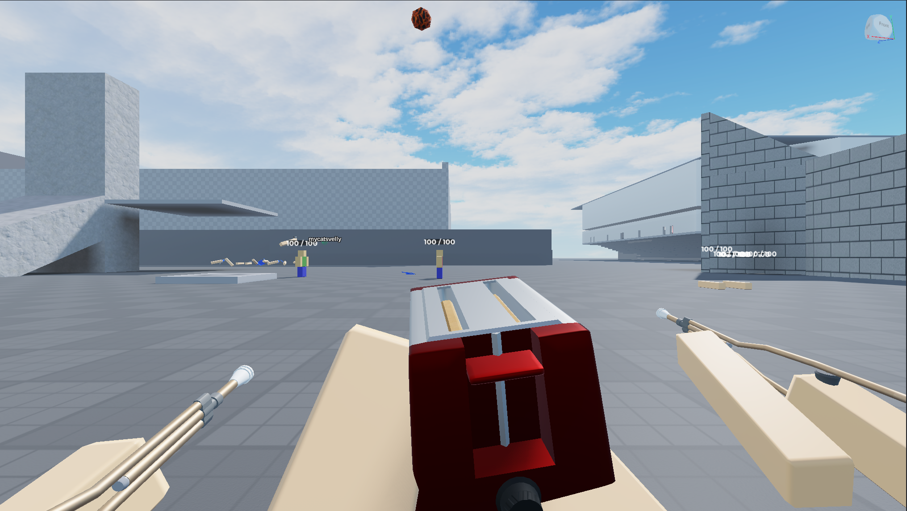

# 26.05.24

회의 안건

1. 맵 스캐일과 배치 + 플레이어 이동속도 조정
2. 토스터기 (샷건) 발사 시스템 , 1인칭화면

---

1. 현재 맵은 근접전에 치중되어있는 경향이 있어 수정 필요

→ 플레이어 이동속도 를 고려하여, 맵 스케일 크기 변경 ( 1.5배~)

→엄패물 배치 변경 ( 원거리 무기도 기회를 살릴수있는 배치로)

      > 김준범,이준서 함께 만들어볼 예정

1. 발사시스템 변경 → 더블배럴 샷건 + 에이펙스 레전드 피스키퍼 ( 초커 시스템 )

           > 조준시 빵이 구워지며 (충전) 탄착군이 좁아짐 > 원거리를 40%~60% 정도의 화력으로 커버가능

 발사구에 아무것도 없지만 화면이 이쁘게 나오는게 중요하므로 그냥 사진처럼 진행 

---

**해야할 일**

김동민 - 토스터기 총기 시스템 제작, 슬라이딩 무빙 시스템 수정, 목발 슬라이딩 모션 수정, 달리기 모션 추가?
가만히 들고 있을 때, 움직임이 있으면 좋겠다.