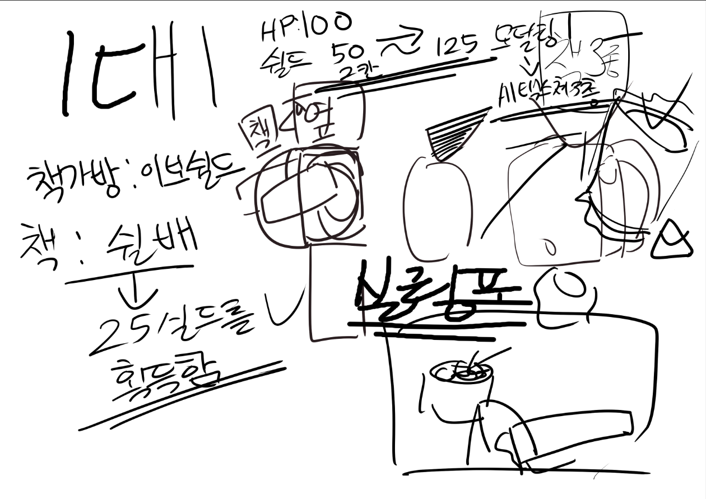

# 26.05.31

김준범 - 실링폼 모델링

이준서 - 컵 투척 에니메이션

김동민 - 이동 조작성 향상&디버깅 

---

1. 쉴드 시스템
2. 게임 프로세스
3. 연출&UI

---

1. 쉴드 시스템

   - 에이펙스 레전드 hp 시스템을 그대로 적용 다음과 같이 대채한다

이보 실드  = 책가방

실드 베터리 = 책 ( 수학책 과학책 등등 방탄판처럼 활용 / 책 한권당 25의 채력을 할당 ) 

회복 방법

- 플레이어 hp (풀피  100 ) - 과자, 사탕 젤리 군것질을 먹으면서 회복 (사용시간 10초 정도 )
- 실드 - 책가방 ( 방탄조끼 ) 을 열고 책을 넣음 (사용시간 6초정도? )

총기 벨런스도 에이펙스 레전드를 그대로 따라가고 ttk를 맞춤

1. 게임 프로세스 

   게임 시작 순서

     - 대기실

     - 게임 준비 (설정,커스터마이즈 등등)

     - 레디

     - 게임 입장

     - 입장 연출 - 가능하면 만들고 싶음

     - 총기 선택 ( 원래 대기실에서 설정하나 1대1에서는 전투 직전에 설정)

     - 카운트 다운 ( 3. 2. 1 )

     - 게임 시작

     - 종료

     - 종료 연출 & 결과창

    - 대기실 복귀

1. 연출 & UI

[https://app.notion.com](https://app.notion.com)

# **메인 메뉴 배경 설정**

**장소:** 학교 농구장 옆 **선수 대기실 / 락커룸**

# **분위기**

- 경기 시작 전 긴장감 있는 느낌
- 어두운 실내에 위에서 떨어지는 스포트라이트
- 막 경기장으로 나가기 직전 같은 분위기
- “왕이 되기 전 대기하는 공간” 같은 느낌

# **배경에 들어가면 좋은 요소**

- **락커(사물함)**
- **벤치**
- **유니폼이나 수건**
- **농구공**
- **작전판 / 화이트보드**
- **바닥에 흩어진 프린트나 책**
- **청소도구나 학교 물건**
- 뒤쪽 문 너머로 경기장 조명이나 소리가 느껴지게 연출

# **캐릭터 배치**

- 왼쪽에 **왕관 쓴 로블록스 캐릭터**
- 손에는 컴퍼스나 목발 같은 대표 무기
- 스포트라이트를 받으며 서 있음
- “이제 경기장으로 나간다”는 느낌