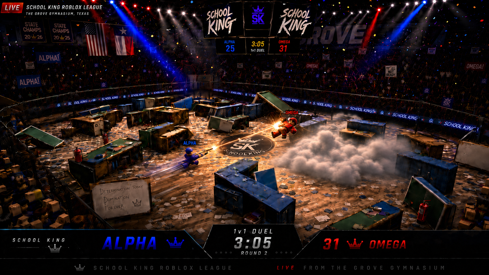

# SCHOOL KING

### 1. 게임 개요

**스쿨 킹은** 학교를 **배경으로 한 1대1 아레나형 무브먼트 슈터이다**.

 『Titanfall』이나 『Apex Legends』와 같은 속도감 있는 이동을 살리면서도, 실제 총기가 아닌 **일상생활 속의 물건을 총처럼 사용하는 것이** 이 작품의 핵심 콘셉트이다.

 플레이어는 학교 체육관, 농구장, 교실 등의 공간에서 전투를 벌인다.

 책상, 캐비닛, 칠판, 탁구대, 서랍 등 학교에 있는 물건들은 단순한 배경이 아니라 **엄폐물, 이동 경로, 전투용 오브젝트로** 활용된다.

 전체적인 분위기는 **학교 +** UFC 경기장 + 로블록스 리그를 합 **친 듯한 이미지다**.

 필드 주변에는 펜스가 설치되어 있고, 관중석에는 Roblox 스타일의 캐릭터 관중들이 모여 1대1 대전을 보며 환호한다.

---

## 2. 핵심 콘셉트

[https://youtube.com/shorts/N7qsvH3WJUE?si=zV-mNcE5GqWQYqa8](https://youtube.com/shorts/N7qsvH3WJUE?si=zV-mNcE5GqWQYqa8)

**일상적인 물건을 총기로 사용하는 아레나형 무브먼트 슈터**

 이 작품의 가장 큰 특징은 실제 총기를 사용하지 않는다는 점이다.

 목발, 나침반, 토스터, 청소기, 쓰레받기, 탄산음료 등 평범한 물건들이 게임 내에서는 총기나 특수 장비처럼 사용된다.

 단순히 외관만 바뀐 무기가 아니라,

 각 물건의 형태와 특성을 살려 **무기 성능, 공격 방법, 특수 능력이** 달라지도록 하는 것을 목표로 한다.

---

## 3. 기본 규칙

**게임은 1 대 1 데스매치 형식의 점수제이다**.

 플레이어는 필드에 스폰된다.

 그 후, **3, 2, 1 카운트다운이 표시되고** 전투가 시작된다.

 상대를 쓰러뜨리면 포인트를 획득하며, 제한 시간 내에 더 높은 점수를 얻은 플레이어가 승리한다.

 기본적인 진행 순서는 다음과 같다.

**스폰 → 카운트다운 → 전투 시작 → 교전 → 점수 획득 → 리스폰 → 반복 → 승패 결정**

 무기의 외형이나 사용법은 특이하지만, 기본 목표는 단순하다.

 상대를 쓰러뜨려 점수를 획득하는 것이 목적이다.

---

## 4. 핵심적인 재미

### 속도감 있는 템포

 이 작품은 느리게 진행되는 전술 슈팅 게임이 아니라, 빠르게 움직이며 계속 싸우는 게임을 지향한다.

 슬라이딩, 점프, 엄폐물 활용, 빠른 재교전이 중요해진다.

### 일상적인 물건을 무기로 사용하는 의외성

 평범한 물건이 전투용 무기가 된다는 점에서 재미가 생긴다.

 예를 들어, 목발은 AR처럼 기능하고, 나침반은 SMG처럼 사용되며, 토스터는 더블 배럴 샷건처럼 기능한다.

### 주무기와 특수 무기의 조합에 따른 전략성

 플레이어는 전투 전에 **메인 무기 1개와 특수 무기 1개를** 선택한다.

 어떤 조합을 선택하느냐에 따라 전투 방식이 달라진다.

 예를 들어,

**목발 + 실링 폼**

 안정적인 사격과 벽 설치를 활용하는 방어형 조합.

**컴퍼스 + 청소기**

 높은 연사력과 밀어내기/당기기 기능을 활용한 근거리 압박형 조합.

**토스터 + 쓰레받기**

 샷건의 높은 화력과 가드/근접전을 활용한 돌격형 조합.

 즉, 단순히 조준만 중요한 게임이 아니라,

**무기 조합에 따라 자신만의 플레이 스타일을 만들어가는 전략성이** 있다.

---

## 5. 무기 분류

 무기는 크게 **주무기, 특수무기, 투척무기로** 나뉜다.

 원래 별도 분류였던 근접 무기는 현재 **특수 무기로 통합되었다**.

---

## 6. 주무기

 메인 무기는 기본 전투와 DPS를 담당하는 무기이다.

 특수 능력보다는 데미지, 연사 속도, 반동, 사거리, 조작감이 중요하다.

### 목발

 역할은 **기본적으로** AR이다.

 가장 안정적인 성능을 가진 기본 주무기로 설정한다.

 중거리전에 적합하며, 초보자도 다루기 쉬운 무기로 한다.

 1인칭 화면에서는 목발의 긴 프레임, 손잡이, 고무 재질의 끝부분 등이 선명하게 보일 필요가 있다.

### 나침반

 역할은 **기본적으로** SMG이다.

 높은 연사력과 근거리전에 특화된 무기이다.

 사거리는 짧지만, 빠른 템포로 상대에게 압박을 가할 수 있다.

 나침반이 펼쳐진 모양, 바늘, 연필 부분이 1인칭 화면에서 명확하게 인식될 수 있도록 한다.

### 토스터

 역할은 **더블 배럴** 샷건이다.

 근거리에서 강력한 일격을 가하는 무기이다.

 토스터의 투입구에서 공격이 나오도록 하면, 물건의 특징을 살리기 쉽다.

 근거리에서는 강력하지만, 빗나갔을 때의 리스크가 큰 무기로 설정한다.

### 우산

**역할은 저격수이다**.

 시간이 있다면 제작할 추가 후보 무기이다.

 우산을 펼치거나 접는 동작을 조준, 재장전, 발사 모션과 결합하여 개성을 살릴 수 있다.

---

## 7. 특수 무기

 특수 무기는 DPS보다 기능성이나 전술적인 활용이 중요한 무기이다.

 근접 무기도 이 분류에 포함된다.

### 대형 청소기

 상대를 **밀어내거나 끌어당기는** 특수 무기이다.

 상대를 엄폐물 밖으로 끌어내거나, 반대로 거리를 두는 용도로 사용할 수 있다.

### 실링 폼

 벽을 설치하는 특수 무기이다.

 순간적으로 엄폐물을 만들거나 상대의 이동 경로를 차단하는 용도로 사용한다.

### 쓰레받기

 가드 모션과 근접 공격을 가진 특수 무기이다.

 본래 쓰레받기는 휘두르는 물건이 아니기 때문에, 무기로 사용할 때 의외성이 생긴다.

 방어와 공격을 동시에 수행할 수 있는 근접형 특수 무기로 설정한다.

### 주먹

 기본 근접 공격이다.

 무기가 없을 때나 근거리 상황에서 사용할 수 있는 기본 공격 수단이다.

---

## 8. 투척 무기

 투척 무기는 전투 중에 던져서 사용하는 보조 무기이다.

### 탄산음료

 흔들어서 던지는 **수류탄과 같은 무기이다**.

 폭발하여 주변에 피해를 주는 형태로 사용할 수 있다.

### 머그컵

**테르밋 수류탄과 같은 무기이다**.

 깨지거나 폭발한 위치에 일정 시간 동안 피해 구역을 형성하는 방식으로 사용할 수 있다.

---

## 9. 장비 구성

 플레이어는 전투 전에 장비를 선택한다.

 기본 구성은 다음과 같다.

**주무기 1개 + 특수 무기 1개 + 투척 무기 1개**

 이 구조를 통해 플레이어는 자신의 전투 스타일에 맞는 조합을 구성할 수 있다.

 공격적으로 밀어붙이고 싶다면,

**컴퍼스 + 청소기**

 안정적으로 싸우고 싶은 경우에는,

**목발 + 실링 폼**

 근거리에서 일격을 노리고 싶다면,

**토스터 + 쓰레받기**

 이처럼 조합에 따라 전투 방식이 달라진다.

---

## 10. 무기 제작 규칙

### 규칙 1. 1인칭 화면에서 물건의 정체가 명확히 드러나야 한다

 본작은 실탄이 아닌 일상적인 물건을 무기로 사용하는 게임이다.

 따라서 플레이어가 1인칭 화면을 봤을 때, 손에 들고 있는 물건이 무엇인지 바로 알 수 있어야 한다.

 목발이라면 손잡이, 긴 프레임, 고무로 된 끝부분이 보여야 한다.

 컴퍼스라면 바늘, 연필 부분, 펼쳐진 형태가 보여야 한다.

 토스터라면 투입구와 사각형 실루엣이 보여야 한다.

 즉, 무기 디자인에서 중요한 것은 단순히 멋지게 만드는 것이 아니라,

**한눈에 무엇인지 알 수 있는 실루엣이다**.

### 규칙 2. 새로운 무기 콘셉트는 의외성에서 출발할 것

 무기 아이디어는 단순히 적당한 것을 고르는 것이 아니라,

**본래의 용도와 전투에서의 사용법 사이의 차이에서** 재미가 생기도록 해야 한다.

 예를 들어, 파리채는 원래 휘둘러서 사용하는 물건이다.

 그렇기 때문에 게임 내에서도 휘두르는 무기로 만들어 버리면 의외성이 약해진다.

 하지만 쓰레받기는 본래 휘두르는 물건이 아니다.

 이를 게임 내에서 막거나 휘두르는 특수 무기로 사용함으로써,

 “이걸 그렇게 쓰는 건가?”라는 의외성이 생긴다.

 따라서 좋은 무기 콘셉트는 다음 조건을 충족해야 한다.

- 본래 무기가 아닌 물건이어야 한다
- 1인칭 화면에서 그것이 무엇인지 바로 알 수 있어야 한다
- 본래의 용도와는 다른 방식으로 사용하는 것
- 플레이어가 봤을 때 재미있거나, 인상에 남는 것
- 진짜 총처럼 보이지 않고, 생활용품을 억지로 무기로 개조한 듯한 느낌이 나야 한다

---

## 11. 전투 밸런스의 기준

 무기 밸런스는 다음 요소를 기준으로 조정한다.

- 데미지
- 데미지 배율
- 연사 속도
- 재장전 속도
- 무기 장전 속도
- 조준 속도
- 반동
- 사거리
- 이동 중 명중 정확도
- 특수 능력 재사용 대기시간
- 근접 공격의 위험과 보상

 특히 이 작품에서는 빠른 템포와 타격감이 중요하다.

 따라서 단순한 수치뿐만 아니라, **쏘는 감각, 명중하는 감각, 움직이며 싸우는 감각도** 중요해진다.

---

## 12. 맵 콘셉트

 무대는 **학교다**.

 체육관, 농구장, 교실, 복도 등을 기반으로 하여,

 학교에 있을 법한 물건들을 전투용 오브젝트로 사용한다.

 예를 들어,

 책상은 엄폐물로 사용한다.

 넘어진 칠판은 발판이나 경사로로 사용한다.

 캐비닛이나 서랍장은 연결된 엄폐 라인을 만든다.

 탁구대, 책장, 의자, 유인물, 책, 소화기 등이 바닥에 흩어져 있어, 전투 후의 혼란스러운 분위기를 연출한다.

 중요한 것은 오브젝트를 흩어 놓는 것이 아니라,

 FPS 맵처럼 **엄폐물과 이동 경로가 자연스럽게 연결되도록 배치하는 것이다**.

---

## 13. 경기장 연출

[https://app.notion.com](https://app.notion.com)

 전체적인 분위기는 **UFC 경기장처럼 관중이 지켜보는 1대1 아레나이다**.

 필드 바깥쪽에는 펜스가 설치되어 있어 플레이어는 밖으로 나갈 수 없다.

 관중석에는 Roblox 스타일의 캐릭터 관중들로 가득 차 있으며,

 관중들은 환호하거나 소리 지르며, 응원봉이나 플래카드를 흔든다.

 경기장 상단에는 대형 스크린이 있어 점수나 승리 연출이 표시된다.

 예를 들어, 알파가 승리하면 스크린에

**ALPHA VICTORY!**

 와 같은 문구가 표시된다.

 조명은 경기장 중앙을 강하게 비추고, 관중석은 비교적 어둡게 하여 전투 공간을 강조한다.

 연기, 종이 비, 환호 연출을 사용하여 실제 스포츠 대회나 e스포츠 결승전과 같은 분위기를 조성한다.

---

## 14. 개발 일정 목표

### 5월 31일까지

 총기의 상세 사양, 무기 시스템, 기본적인 전투 구조를 어느 정도 확정한다.

 이 시점까지 기본적인 무기의 방향성과 역할이 정리되어 있다면, TGS 전시를 목표로 삼기 쉬워진다.

### 10일~17일 사이

 준봄은 무기 모델링을 진행한다.

 나는 애니메이션 작업을 진행한다.

 동민은 버그 수정, 기본 시스템 구축, 수정 사항 반영을 진행한다.

### 7월 중순

 MVP를 완성하고 선생님께 확인을 받는다.

### 8월

 수정 사항을 반영하고, 버그 수정 및 추가 확인을 진행한다.

### 9월 17일 전후

 TGS 출전을 목표로 한다.

---

## 15. 한 문장 설명

**스쿨 킹은 학교에 있는 일상적인 물건을 무기로 사용하는 1대1 아레나형 무브먼트 슈터로, 속도감 있는 이동, 개성 있는 무기 조합, 그리고 Roblox 리그와 같은 경기장 연출이 특징인 게임이다.**

## 간략한 설명

**스쿨 킹은 목발, 컴퍼스, 토스터 등 일상적인 물건을 무기로 사용하여 싸우는, 학교를 배경으로 한 1대1 고속 아레나 슈팅 게임이다.**