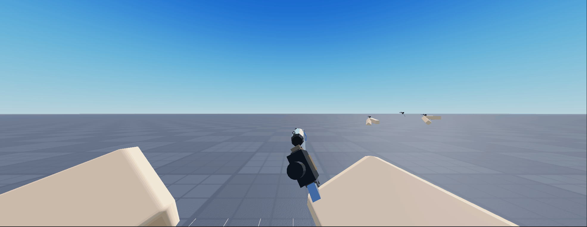
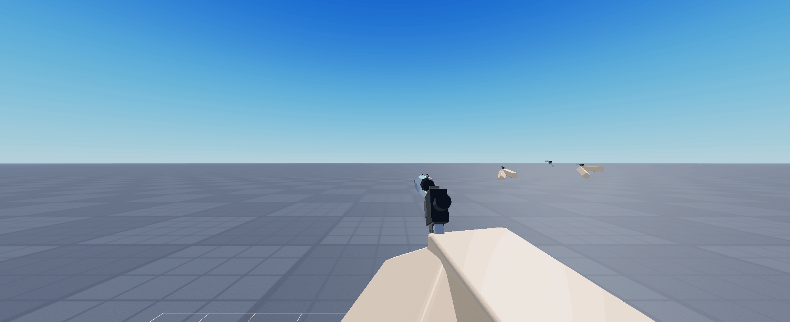
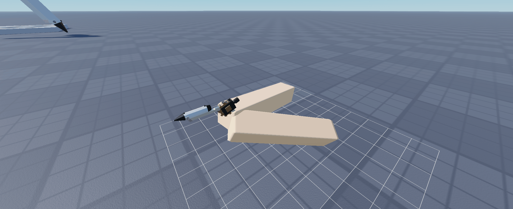
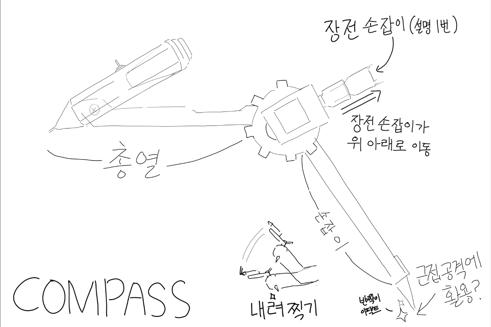
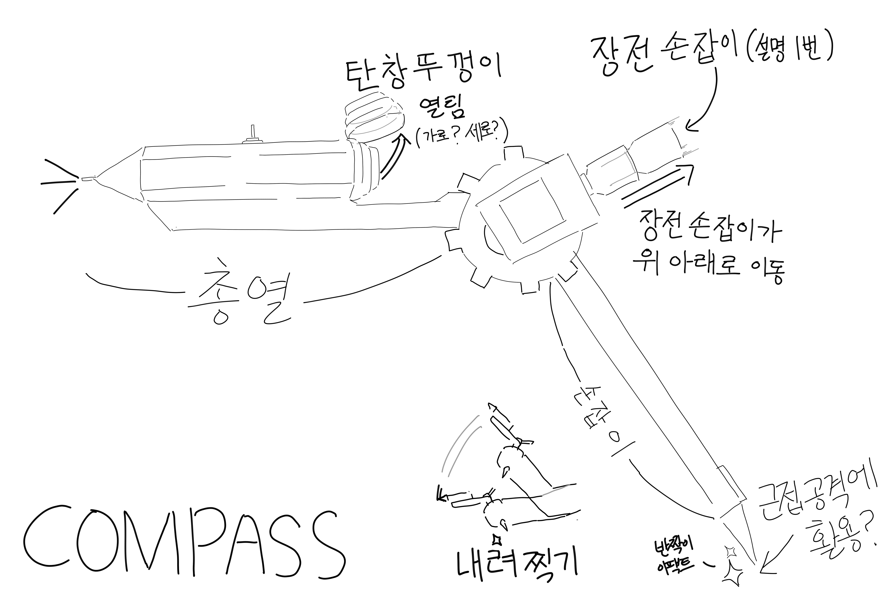

# 장전 아이디어

1. 총기를 45도 왼쪽 방향으로 돌림과 동시에 손잡이 부분(실제 총기의 장전 손잡이 부분 역활) 을 당기기or 비틀기 — 개인적으로는 당기기가 훨씬 역동적이라 당기기 추천 (손잡이 부분은 당겨져있는 상태)
2. 손잡이 부분의 움직임과 동시에 샤프심통(탄창 역활)  열림 —(이것또한 장전중에는 열려있는 상태)
3. 왼손으로 샤프심통 을 들어 탄창에 심 (총알) 넣기 —시간은 0.7초 정도로 생각중
4. 총알을 다 넣어지면 당겨져있는 장전 손잡이 를 탁! 치며 ( HK MP5 장전) 열려있던 샤프심통이 닫힘
5. 총기를 오른쪽 45도 회전후 원래위치
6. 장전 끝

탄창 자체 교체

86663995928860

112924929562490

(회의 후 상세 에니메이션 레퍼런스 이미지 제작)

https://www.youtube.com/shorts/VQfXUVigLC4

[콘티](%EC%BD%98%ED%8B%B0/index.md)

장전 손잡이를 당길시 기어+실런더 내려감

레퍼런스 가 더 필요함  (자료 필수)

다른 총기의 장전모션도 참고하면 좋을듯