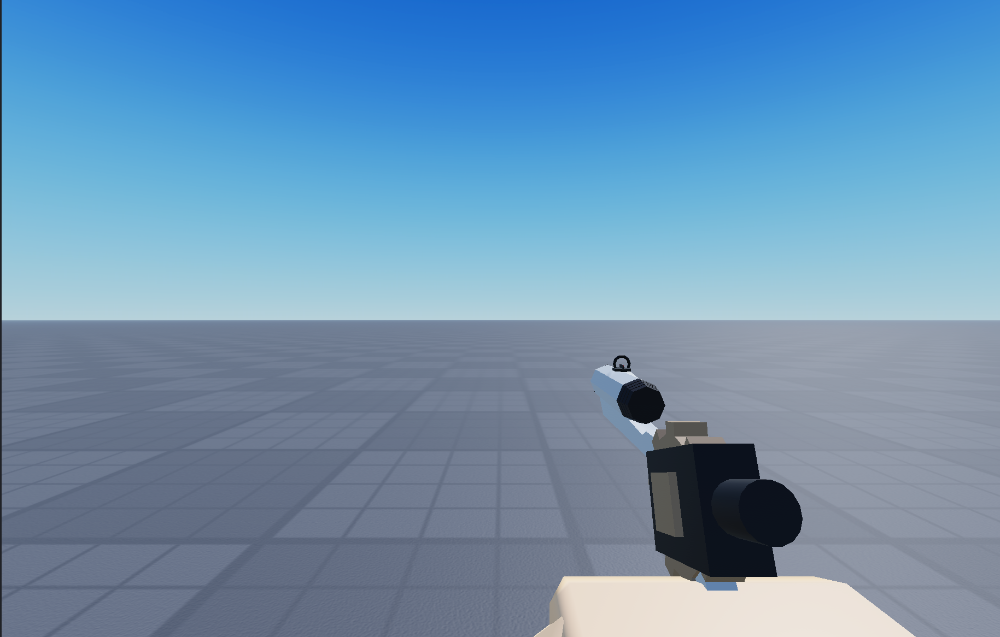

# 콘티

(장전 손잡이 당기기 철컥!)

(장전 손잡이가 당겨져있는 상태)

(팅!하고 날라가며 연기가 났으면 좋을거같음)

(탄창이 빙글빙글 날라가는중 )

(새로운탄창 가져옴) 다시보니 탄창 각도좀 틀어짐

(결합중)

(결합 완)

(시점이 점점 내려가서 잘 안보였는데 지금 비율로 하면 좋을듯)

(mp5 장전 탁! 치기)

탁 치고 손을 뻗음

기어+실린더 원상 복귀

장전 끝

-사운드 자료-

[https://www.youtube.com/watch?v=PnZv-uBKtbE](https://www.youtube.com/watch?v=PnZv-uBKtbE)