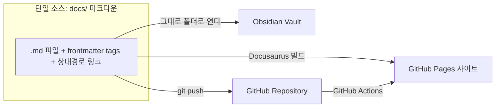
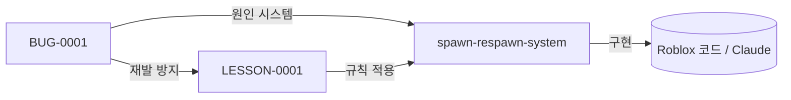

# School KING 시스템 위키 — 3중 운영 설계서

> Repo · GitHub Pages · Obsidian 을 **하나의 동일한 논리 구조**로 운영하기 위한 설계.
> 핵심 원칙: **단일 소스(Single Source of Truth) = `docs/` 폴더의 마크다운 파일.**
> 코드는 Claude가 생성, 구조·검증·기록은 사람이 담당한다.

---

## 0. 한 장 요약



같은 파일을 **3가지 방식으로 볼 뿐**이다. 구조를 한 번만 잘 잡으면 셋이 동시에 정렬된다.

---

## 1. GitHub Repository 폴더 구조

```text
SchoolKing_wiki/
├── docs/                          ← 단일 소스 (Pages·Obsidian 둘 다 이 폴더를 읽음)
│   ├── intro.md                   # 위키 홈
│   │
│   ├── overview/                  # 🗺️ Project Overview
│   │   ├── _category_.json
│   │   ├── index.md               # 프로젝트 개요
│   │   ├── game-concept.md
│   │   ├── glossary.md            # 용어집 (검색·링크 기준)
│   │   └── tech-stack.md
│   │
│   ├── architecture/              # 🏗️ System Architecture
│   │   ├── _category_.json
│   │   ├── index.md               # 시스템 맵(mermaid) + 목록
│   │   ├── client-server-model.md
│   │   ├── data-flow.md
│   │   └── systems/               # 개별 시스템 명세
│   │       ├── _category_.json
│   │       ├── weapon-system.md
│   │       ├── ammo-system.md
│   │       ├── combat-damage-system.md
│   │       ├── spawn-respawn-system.md
│   │       ├── scoring-rank-system.md
│   │       ├── ui-hud-system.md
│   │       └── event-system.md
│   │
│   ├── features/                  # ✨ Feature History
│   │   ├── _category_.json
│   │   ├── index.md               # FEAT 목록(표)
│   │   ├── FEAT-0001-grenade-fragmentation.md
│   │   └── FEAT-0002-mug-puddle-grenade.md
│   │
│   ├── bugs/                      # 🐞 Bug History
│   │   ├── _category_.json
│   │   ├── index.md               # BUG 목록(표)
│   │   └── BUG-0001-spawn-invincibility-timing.md
│   │
│   ├── lessons/                   # 📘 Lessons Learned
│   │   ├── _category_.json
│   │   ├── index.md
│   │   └── LESSON-0001-server-authority-timing.md
│   │
│   ├── todo/                      # ✅ TODO / Future Plan
│   │   ├── _category_.json
│   │   ├── index.md
│   │   ├── roadmap.md
│   │   └── backlog.md
│   │
│   ├── keywords/                  # 🔑 Keyword Index (검색 허브)
│   │   ├── _category_.json
│   │   ├── index.md
│   │   ├── weapon.md
│   │   ├── ammo.md
│   │   ├── ui.md
│   │   └── event.md
│   │
│   ├── _templates/                # 기록 양식 (밑줄 = Pages엔 안 뜸, Obsidian엔 보임)
│   │   ├── feature.md
│   │   ├── bug.md
│   │   ├── lesson.md
│   │   └── system.md
│   │
│   └── 위키-사용법/                # 편집/검색 방법 안내
│
├── static/
│   ├── admin/                     # 웹 편집기 (Decap CMS)
│   │   ├── index.html
│   │   └── config.yml             # bug/feature/lesson... 컬렉션
│   └── uploads/                   # CMS 이미지 업로드 위치
│
├── cms-worker/                    # GitHub 로그인용 Cloudflare Worker
│   ├── worker.js
│   └── wrangler.toml
│
├── .github/workflows/deploy.yml   # push → 자동 빌드·배포
├── docusaurus.config.js
├── sidebars.js                    # docs 폴더 구조 그대로 자동 사이드바
├── package.json / package-lock.json
│
├── 시스템_위키_설계서.md           # (이 문서)
├── OBSIDIAN_사용법.md
├── CMS_로그인_설정_가이드.md
├── 운영_백업_가이드.md
├── 첫_PUSH_가이드.md
└── push.bat                       # 원클릭 커밋+push
```

**설계 포인트**

- 카테고리 = 폴더. 폴더 순서/이름은 `_category_.json`이 담당 → URL은 깨끗하게, 순서는 자유롭게.
- 구조적 기록(버그·기능·교훈)은 **ID 파일**(`BUG-0001-...md`)로. 검색·추적·정렬이 쉬움.
- 양식은 `_templates/`에. 밑줄 폴더라 사이트엔 안 뜨고 Obsidian/레포에선 복사용으로 보임.

---

## 2. GitHub Pages 페이지 트리 (검색 가능한 문서 사이트)

`docs/` 폴더가 그대로 사이트 사이드바가 된다 (`sidebars.js`의 autogenerated).

```text
School KING 위키  (https://ghkdlxm005.github.io/SchoolKing_wiki/)
├── System Wiki 홈                    (/docs/intro)
├── 🗺️ Project Overview
│   ├── 프로젝트 개요
│   ├── 게임 컨셉 상세
│   ├── 용어집 (Glossary)
│   └── 기술 스택
├── 🏗️ System Architecture
│   ├── 시스템 아키텍처 개요          (시스템 맵 다이어그램)
│   ├── 클라이언트-서버 모델
│   ├── 데이터 흐름
│   └── 게임 시스템
│       ├── 무기 시스템
│       ├── 탄약/게이지 시스템
│       ├── 전투/데미지 시스템
│       ├── 스폰/리스폰 시스템
│       ├── 점수/랭크 시스템
│       ├── UI/HUD 시스템
│       └── 이벤트 시스템
├── ✨ Feature History
│   ├── 기능 이력(표)
│   ├── FEAT-0001 세열 수류탄
│   └── FEAT-0002 머그컵 장판 수류탄
├── 🐞 Bug History
│   ├── 버그 이력(표)
│   └── BUG-0001 스폰 무적 타이밍
├── 📘 Lessons Learned
│   ├── 교훈 목록
│   └── LESSON-0001 서버 권위 타이밍
├── ✅ TODO / Future Plan
│   ├── TODO 개요
│   ├── 로드맵
│   └── 백로그
├── 🔑 Keyword Index
│   ├── 키워드 인덱스
│   ├── Weapon · Ammo · UI · Event
└── 📖 위키 사용법
```

상단 우측: **🔍 검색창**(전체 본문) · **✏️ 편집**(웹 편집기) · **GitHub**.

> 참고: 여기서 "Wiki"는 GitHub의 별도 `.wiki` 기능이 아니라 **GitHub Pages 문서 사이트**다.
> Pages는 같은 레포에서 자동 빌드되어 단일 소스가 깨지지 않는다(별도 wiki는 동기화가 어려워 쓰지 않음).

---

## 3. Obsidian Vault 구조

Obsidian은 **`docs/` 폴더를 그대로 Vault로 연다.** 폴더 트리 = 위 1번과 동일.

```text
Vault (= docs/)
├── overview/        #overview
├── architecture/    #system        ← systems/ 안에 시스템별 노트
├── features/        #feature  (FEAT-#### 노트)
├── bugs/            #bug      (BUG-#### 노트)
├── lessons/         #lesson   (LESSON-#### 노트)
├── todo/            #todo
├── keywords/        #keyword
└── _templates/      (양식 — Obsidian에선 보임)
```

- **링크**: 상대경로 마크다운 링크 `[..](../bugs/BUG-0001-...md)` — Obsidian·Pages 둘 다 동작.
  (Obsidian 설정에서 Wikilinks 끄고 Relative path 사용 → [OBSIDIAN_사용법.md](./OBSIDIAN_사용법.md))
- **태그**: 프런트매터 `tags: [bug, weapon]` — Obsidian 태그 패널 + Pages 양쪽 인식.
- **그래프 뷰**: 버그→시스템→교훈 연결을 시각화. 링크를 걸수록 풍부해짐.

---

## 4. 왜 이렇게 설계했는가

1. **단일 소스 원칙.** 세 곳을 따로 관리하면 반드시 어긋난다. `docs/` 마크다운 하나만 두고,
   Pages는 "렌더링 뷰", Obsidian은 "로컬 뷰", Repo는 "원본+이력"으로 역할만 나눴다.
2. **폴더 = 카테고리 = 논리 구조.** 셋의 트리가 자동으로 같아진다(같은 폴더를 보니까).
3. **ID 기반 기록.** `BUG-####`, `FEAT-####`, `LESSON-####`로 영구 식별자를 부여 →
   링크가 안 깨지고, "이 버그 어디서 고쳤더라?"가 검색 한 번에 끝난다.
4. **변경 이유를 강제.** 각 문서에 "왜(의도/원인)" 섹션과 변경 로그를 둬서,
   6개월 뒤에도 *왜 이렇게 됐는지*가 남는다. (코드만으론 절대 안 남는 정보)
5. **코드 위의 레이어.** 시스템 명세(architecture)는 구현과 분리돼 있어,
   코드를 갈아엎어도 *무엇을 만들어야 하는지*는 위키에 남는다.

---

## 5. 검색은 어떻게 동작하는가

세 갈래로 동시에 검색된다.

1. **전체 본문 검색 (Pages)** — `@easyops-cn/docusaurus-search-local` 플러그인.
   오른쪽 위 🔍에 `수류탄`, `리스폰`, `게이지` 등 입력 → 한국어로 전체 문서 검색(오프라인 동작).
2. **키워드 허브 (Keyword Index)** — `Weapon / Ammo / UI / Event` 페이지가
   해당 주제의 모든 관련 문서를 손으로 모아둔 "출발점". 검색어가 막연할 때 여기서 출발.
3. **태그 (Obsidian + Pages)** — 프런트매터 `tags:`로 묶음.
   Obsidian에선 `tag:#bug`, Pages에선 태그 페이지로 같은 묶음을 본다.

> 즉 "정확한 단어를 알면 🔍, 주제로 둘러보려면 키워드 허브, 분류로 모으려면 태그."

---

## 6. 버그 추적은 어떻게 되는가

**버그 1건 = 파일 1개 = 영구 ID.**

```text
1. 발견  → docs/bugs/ 에 _templates/bug.md 복사 → BUG-0002-제목.md
2. 작성  → 증상 / 원인 / 해결 / 재발방지 + frontmatter(tags, 심각도는 본문 표)
3. 연결  → 관련 시스템 문서로 링크, 원인이 된 기능(FEAT)로 링크
4. 규칙화 → 재발 방지는 LESSON-#### 으로 승격, 그 LESSON을 해당 시스템 문서에 역링크
5. 색인  → docs/bugs/index.md 표에 한 줄 추가 (ID·심각도·상태·시스템)
```

추적 흐름:



- **상태**: `open → 수정 중 → fixed → 재발 감시` (각 BUG 문서 상단 표)
- **심각도**: `critical / high / medium / low`
- **"왜"가 핵심**: 원인(왜 생겼나)과 해결(무엇을 왜 바꿨나)을 반드시 적어, 같은 실수를 반복하지 않는다.
- Git 이력까지 더하면 **누가·언제·무엇을** 바꿨는지도 자동으로 남는다(파일 History).

---

## 7. 일상 운영 흐름

```text
[Obsidian 또는 웹 편집기에서 문서 작성/수정]
        │
        ├─ 로컬(PC):  push.bat 더블클릭
        └─ 웹:        ✏️ 편집(/admin) → Publish
        │
        ▼
   GitHub Repo (원본 + 변경 이력)
        │  GitHub Actions
        ▼
   GitHub Pages (검색되는 사이트, 1~2분 후 반영)
```

- 새 기능 만들 때: 위키에 `FEAT-####` 먼저 적고(의도), Claude에게 구현 요청, 결과를 변경 로그에 기록.
- 버그 생기면: `BUG-####` 먼저 적고, 고친 뒤 `LESSON-####`로 규칙화.
- 정기 백업·복구: [운영_백업_가이드.md](./운영_백업_가이드.md).
